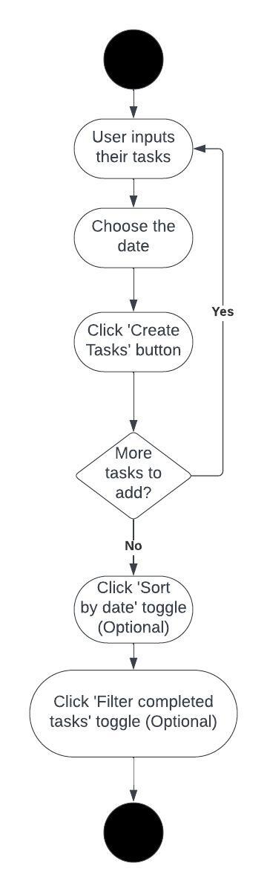

# Lab 2 Write-Up

## I. Introduction

**Name**: Tao Yang  
**Date**: 8/7/2023  
**Topic**: JavaScript

## II. Executive Summary

This Lab delves into the dynamics of JavaScript. Lab 2A introducing key concepts such as DOM manipulation, CRUD operations, and local storage for persistent data. Further, Object-Oriented Programming concepts were integrated into the JavaScript development process. Lab 2B lab addresses Higher-Order Functions and their role in sorting and filtering data.

## III. Design Overview

### Lab 2b JavaScript UML

## Lab 2b Screenshots

### Starting tasks

### Sort by date

### filter-completed-tasks

### File Descriptions

- index.html Contains all the basic structures of the site
- style.css Contains the comprehensive style guide of the site
- script.js is the structure of the javaScript code
- script1.js the actual JavaScript code that provide the abilities to inputting and organizing tasks

# Writeup Questions

## Lab 2A

#### What are two differences and similarities between JavaScript and C++? (Think of differences and similarities that are more unique to these 2 languages not all languages in general)

Similarities:

- OOP: Both support object-oriented programming.
- Syntax: Shared constructs like loops and conditionals.

Differences:

- Memory Management: C++ uses pointers; JavaScript uses garbage collection.
- Runtime Environment: C++ is compiled; JavaScript is interpreted (browser/server-side).

#### What is the difference between JSON and JavaScript objects?

- Nature: JSON is a data interchange format; JavaScript objects are in-memory data structures.
- Syntax: JSON requires keys in double quotes; JavaScript objects don't.
- Methods: JSON cannot store methods; JavaScript objects can.
- Parsing: JSON data needs parsing to become a JavaScript object.

#### If you open your web page in two different browsers, will changes on one appear on the other? Why or why not?

No, changes made in my to-do list app on one browser will not automatically appear on the other. Each browser maintains its own local user input data, cache, and session storage. Therefore, tasks or dates entered in one browser won't be reflected in another unless the data is synchronized through a central server.

#### How long did you spend on this lab?

20 hours

## Lab 2b

#### How did you protect your site against Cross-Site Scripting? Which type of Cross-Site Scripting did you protect against?

The site was protected from Cross-Site Scripting (XSS) attacks by sanitizing user input, ensuring malicious scripts are not executed. Primarily, the protection was against Stored XSS attacks, where malicious scripts are stored on the server through forms or similar means.

#### What is a Higher-Order Function?

A Higher-Order Function is a function that either takes one or more functions as arguments, or returns a function as its result. This allows for operations like map, reduce, and filter in JavaScript, facilitating more functional programming approaches.

#### What are the differences between the oninput, onkeyup, and onchange events? When do they trigger, when might you use one over the others?

The oninput event triggers every time the value of an input element changes, which happens immediately after the value changes. The onkeyup event is fired when a keyboard key is released. The onchange event triggers when the element loses focus and its value has been changed since gaining focus. Depending on the user interaction one wants to capture, oninput is ideal for real-time response, onkeyup is specific to key releases, and onchange is for changes finalized by moving away from the element.

# Lessons Learned

I learned how to combined the JsvaScript functions with the html structure through DOM and adjust the CSS accordingly. I also learned the basic saving and manipulating the data through the local storage of the browser.

# Conclusions

- JavaScript Proficiency: Enhanced web dynamics using Document Object Model (DOM) manipulation.
- Data Management: Implemented CRUD operations and local storage for persistent browser data.
- Enhanced Functionality: Utilized Higher-Order Functions for task sorting and implemented defenses against Cross-Site-Scripting attacks.
- UML Activity Diagrams: Created diagrams outlining task input, sorting, and filtering functionalities for clear developmental guidance.

# Reference

[www.helpmyprofessor.com](http://www.helpmyprofessor.com)
